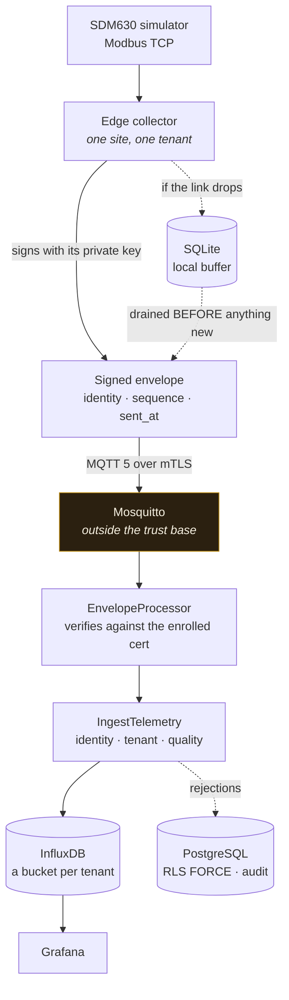
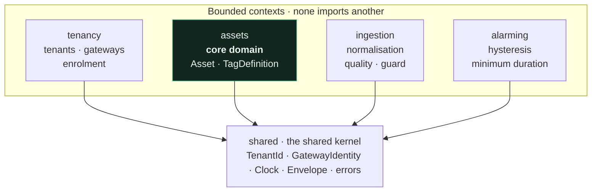
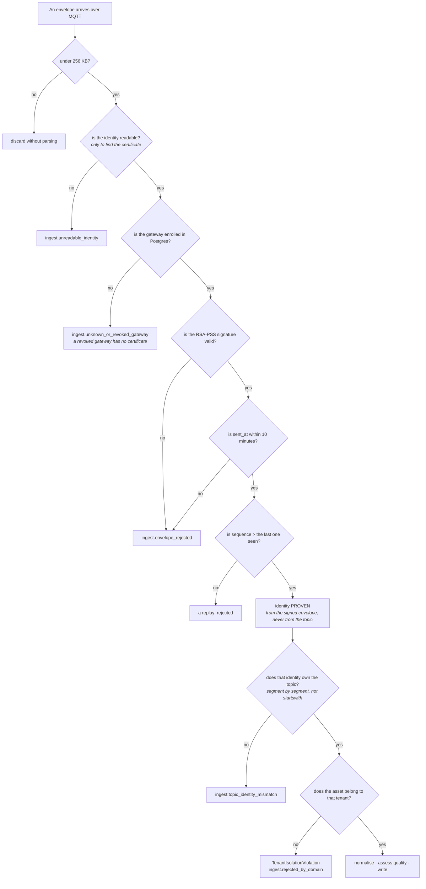
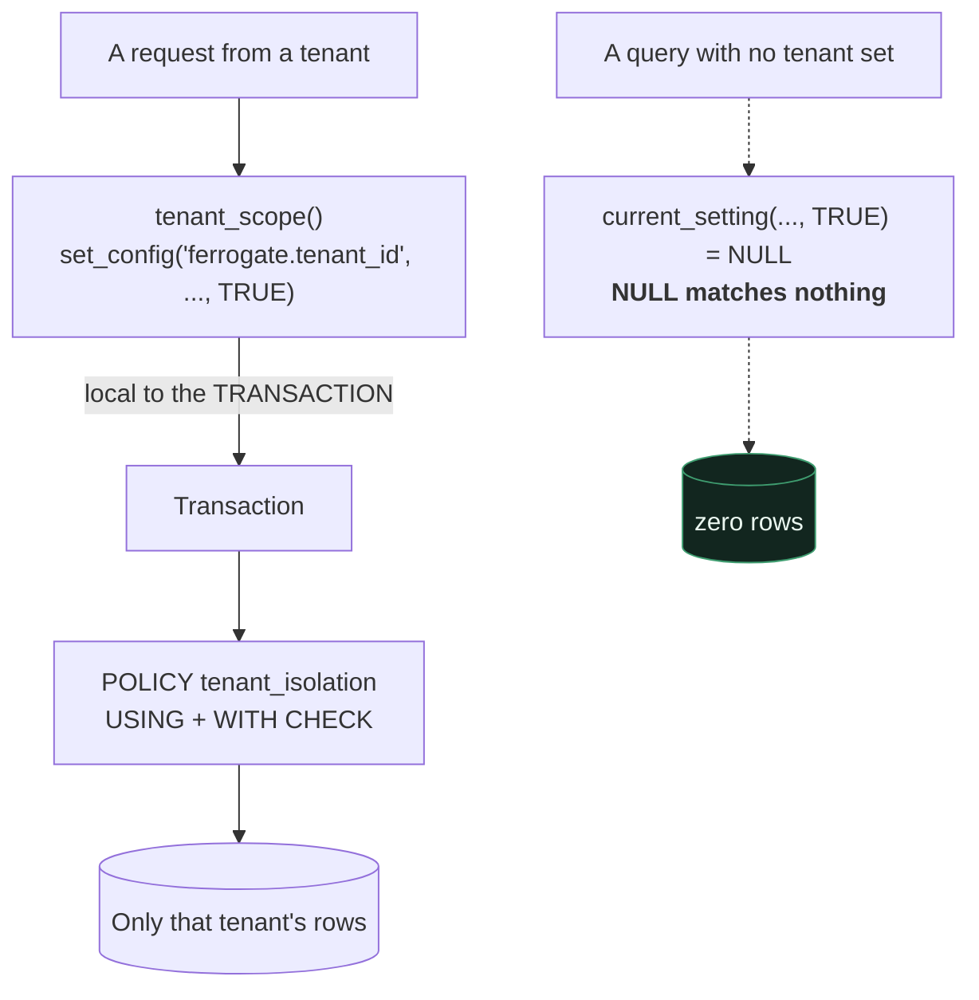

# Ferrogate

**Multi-tenant industrial telemetry, with the tenant boundary enforced by the database
engine rather than by remembering to write a `WHERE` clause.**

Edge gateways speak Modbus TCP/RTU against simulated devices, normalise readings into a
tag model that carries data quality, and publish over MQTT on mTLS to a platform where
every reading arrives inside an envelope signed at the edge.

https://github.com/user-attachments/assets/a6826689-530c-48cd-af2b-8a3253fda893

<sub>A Modbus simulator, the edge collector signing on site, ingestion verifying the
signature against the enrolled certificate, and the measurement landing in InfluxDB.</sub>

---

## At a glance

|  |  |
| --- | --- |
| **What it is** | The path an industrial reading takes from a Modbus register to a Grafana panel, with the tenant boundary held at every step. |
| **The one idea** | The broker is **not** in the trust base. It can replay, reorder or mix messages; it cannot forge one, because the signature is verified against the certificate enrolled in Postgres and never against anything the topic claims. |
| **Built with** | Python · DDD with four bounded contexts · PostgreSQL 17 with `FORCE ROW LEVEL SECURITY` · InfluxDB · Mosquitto · Grafana |
| **Size** | ~2 100 lines · **62 tests** · two architecture contracts that fail the build |
| **Isolation** | Row Level Security with `FORCE`, scoped to the transaction — a query that forgets to set the tenant returns zero rows, not somebody else's |
| **Identity** | Per-gateway certificate, identity in the SAN, envelope signed with RSA-PSS at the edge, sequence numbers against replay |
| **Run it** | `make up && make seed && make verify` — POSIX only; on Windows use WSL2 |

**Contents** — [Architecture](#architecture) ·
[How a reading becomes trusted data](#how-a-reading-becomes-trusted-data) ·
[Isolation in the engine](#isolation-in-the-engine-not-in-the-code) ·
[Quick start](#quick-start) · [Status](#status) · [Decisions](#decisions) ·
[What it does not do](#what-it-does-not-do)

---

## Architecture

The whole path works end to end: Modbus simulator → edge collector → MQTT over mTLS with
a signed envelope → ingestion → InfluxDB → Grafana.



The broker is marked on purpose: **it is not in the trust base**. It can forward, reorder
or mix messages, but it cannot fabricate a valid one, because the signature is checked
against the certificate enrolled in Postgres rather than against anything arriving with
the message.

### Four bounded contexts

They do not import each other. `lint-imports` fails the build if one does; only the
shared kernel is a legitimate dependency of all of them.



| Context | Responsibility | Lines |
| --- | --- | --- |
| `shared` | The kernel: `TenantId`, `GatewayIdentity`, the clock, the envelope, the error types | 403 |
| `tenancy` | Tenants, gateways and enrolment — who is allowed to speak at all | 66 |
| `assets` | The core domain: `Asset`, `TagDefinition`, units and ranges | 286 |
| `ingestion` | Normalisation, data quality, and the identity guard that decides what is accepted | 512 |
| `alarming` | A state machine with hysteresis and a minimum duration | 111 |
| `edge/` | The collector: one site, one tenant, and no multi-tenant logic anywhere in it | 443 |
| `simulators/` | An SDM630 over Modbus and an OPC-UA line, with fault injection | 202 |

```text
src/ferrogate/
  shared/        kernel: TenantId, events, clock, gateway identity
  tenancy/       tenants, gateways, enrolment
  assets/        core domain: Asset, TagDefinition, units and ranges
  ingestion/     normalisation, data quality, identity guard
  alarming/      state machine with hysteresis and minimum duration
edge/            collector: one site, one tenant, no multi-tenant logic
simulators/      SDM630 Modbus + an OPC-UA line, with fault injection
```

The edge collector knowing nothing about multi-tenancy is the point, not an omission: a
gateway that cannot name a second tenant cannot leak into one.

---

## How a reading becomes trusted data

Each step discards before it spends. Swapping 3 and 4 — checking the topic before the
proven identity — is exactly how one tenant's data ends up in another's.



---

## Isolation in the engine, not in the code



`FORCE ROW LEVEL SECURITY` applies the policy **to the table's owner as well**, which is
the case people forget. And the scope is local to the transaction: with a connection
pool, a session-level `set_config` would leave the next request inheriting the previous
request's tenant.

The failure mode is the right way round. Forgetting to set the tenant returns **zero
rows**, not somebody else's — a bug that is loud and safe rather than quiet and a breach.

---

## Quick start

Requires a POSIX environment. On Windows use WSL2: the stack — openssl, volume mounts,
Mosquitto's permissions — assumes POSIX paths and permissions, and Git Bash struggles.

```bash
python -m venv .venv && source .venv/bin/activate
make install              # editable install + dev dependencies
cp .env.example .env      # fill in the passwords
make pki                  # lab CA + gateway certificates
make up                   # bring the whole stack up
make seed                 # enrol gateways, assets and tags
make verify               # check the whole chain end to end
make test                 # unit and architecture tests
make arch                 # layer contracts and context independence
make security             # bandit, pip-audit
```

---

## Status

Everything above works end to end, with 62 tests, two architecture contracts and a clean
bandit run. The Grafana panels are in place: `ops/grafana/provisioning` provisions the
InfluxDB datasource and a telemetry dashboard of ten panels across three rows.

Still open, in dependency order:

- **Wire the alarming context into the pipeline.** The domain is written —
  `alarming/domain/alarm.py` carries the state machine and its unit test. What is missing
  is the use case that evaluates it against each ingested measurement, and the
  infrastructure that persists and notifies; today `alarming/application/` and
  `alarming/infrastructure/` contain only `__init__.py`.
- **A two-tenant integration test on Docker.** `docker-compose.yml` already brings up
  `sim-acme` and `sim-globex` with their two edge collectors; what is missing is the test
  that starts the stack and proves no data from one tenant crosses into the other's
  bucket or RLS-protected rows. `tests/integration/` is empty.
- **An OPC-UA adapter.** Today `opcua` exists only as a value of the protocol enum in
  `tag_definition.py`: the client and its mapping to `TagDefinition` are missing.

---

## Decisions

- Tenant isolation by Row Level Security with `FORCE` — [ADR 0001](docs/adr/0001-aislamiento-de-tenant.md)
- Gateway identity in the certificate's SAN — [ADR 0002](docs/adr/0002-identidad-de-gateway.md)
- End-to-end signed telemetry — [ADR 0005](docs/adr/0005-sobre-firmado.md)
- STRIDE threat model — [docs/security/threat-model.md](docs/security/threat-model.md)

---

## What it does not do

It does not try to replace a SCADA or a historian. It is a reproducible test bench with
no hardware: if you have a real meter, the simulator is swapped for it without touching
the domain — that is what the `DeviceReader` port is for.

---

## License

MIT — see [LICENSE](LICENSE).
