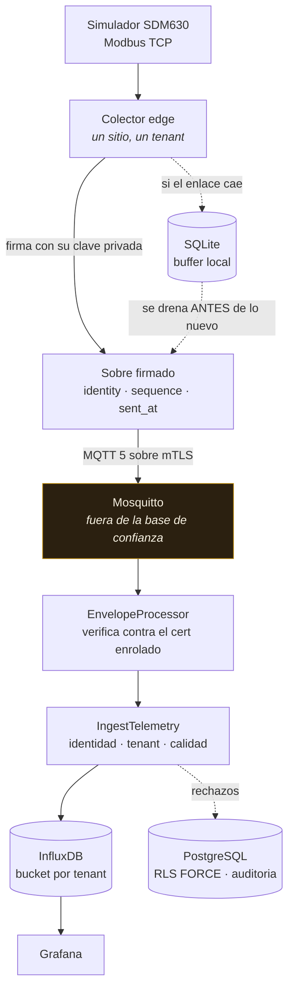
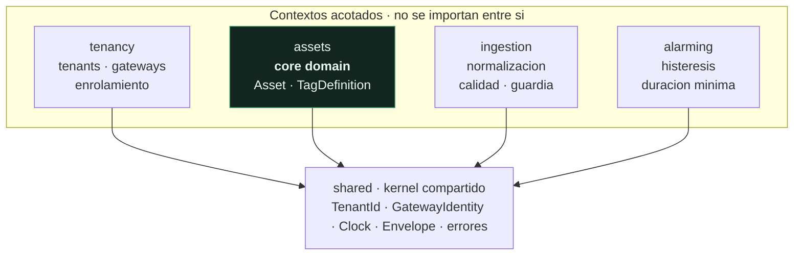
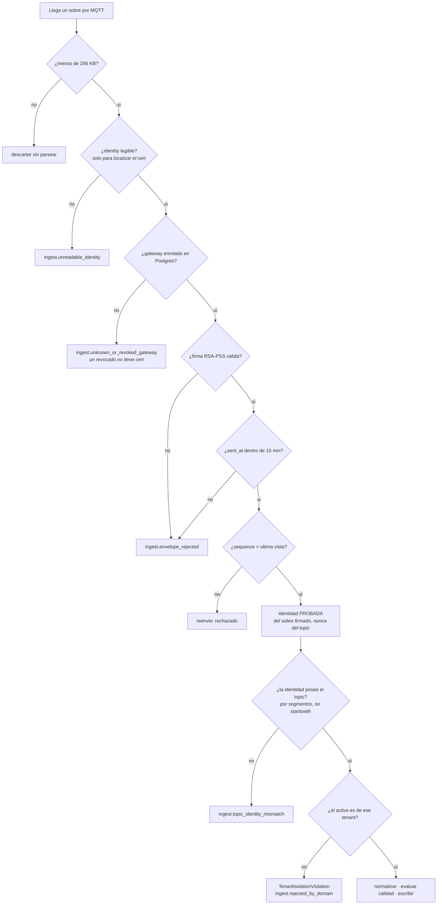
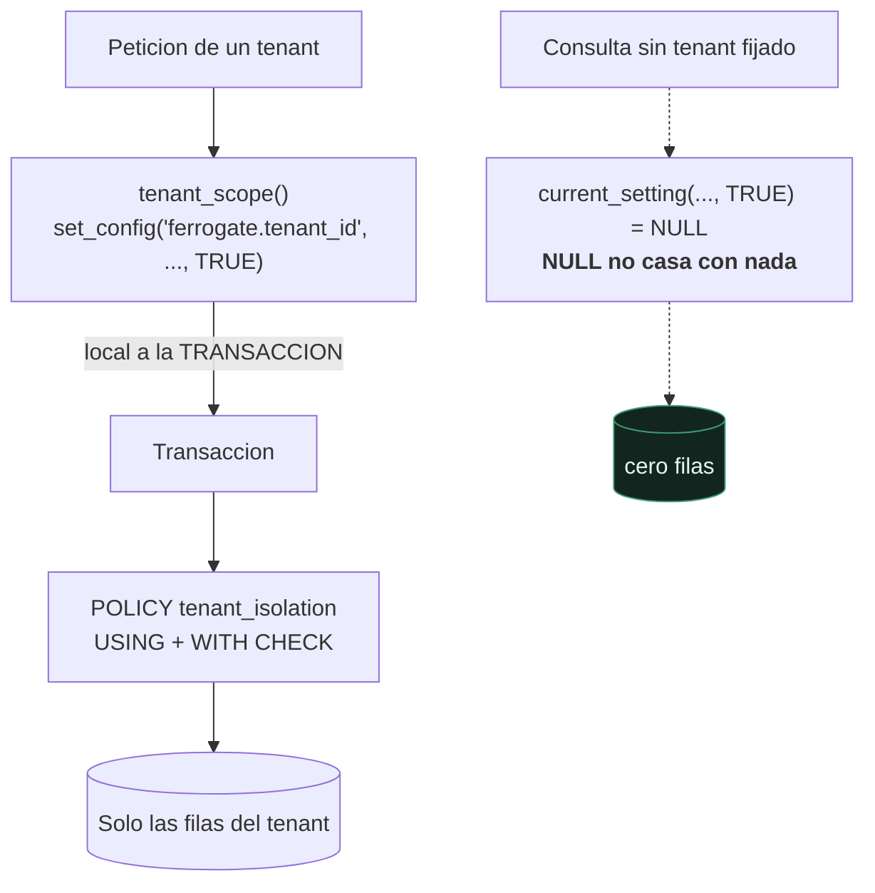

# Ferrogate

Plataforma multi-tenant de telemetría industrial. Gateways edge que hablan
Modbus TCP/RTU y OPC-UA contra dispositivos simulados, normalizan a un modelo
de tags con calidad de dato, y publican por MQTT sobre mTLS hacia una
plataforma que aísla a cada cliente en el motor, no en el código.

DDD con cuatro contextos acotados, arquitectura hexagonal verificada por
tests que fallan el build, y seguridad tratada como requisito de dominio.

## Demo

Simulador Modbus, colector edge firmando en el sitio, ingesta verificando la
firma contra el certificado enrolado, y la medida llegando a InfluxDB.

https://github.com/user-attachments/assets/a6826689-530c-48cd-af2b-8a3253fda893

## Estado

Recorrido completo funcionando: simulador Modbus -> colector edge -> MQTT
sobre mTLS con sobre firmado -> ingesta -> InfluxDB -> Grafana.
62 tests, dos contratos de arquitectura, bandit limpio.



El broker aparece marcado a propósito: **no está en la base de confianza**.
Puede reenviar, reordenar o mezclar mensajes, pero no fabricar uno válido,
porque la firma se verifica contra el certificado enrolado en Postgres y no
contra nada que venga del topic.

Los paneles de Grafana ya estan: `ops/grafana/provisioning` aprovisiona el
datasource de InfluxDB y un dashboard de telemetria con diez paneles repartidos
en tres filas.

Pendiente, por orden de dependencia:

- **Conectar el contexto de alarmas al pipeline.** El dominio ya esta escrito:
  `alarming/domain/alarm.py` lleva la maquina de estados y su test unitario.
  Falta el caso de uso que la evalua contra cada medida ingerida y la
  infraestructura que la persiste y la notifica; hoy `alarming/application/` e
  `alarming/infrastructure/` solo contienen `__init__.py`.
- **Test de integracion con dos tenants sobre Docker.** El `docker-compose.yml`
  ya levanta `sim-acme` y `sim-globex` con sus dos colectores edge; falta la
  prueba que arranque el stack y verifique que ningun dato de un tenant cruza
  al bucket ni a las filas con RLS del otro. `tests/integration/` esta vacio.
- **Adaptador OPC-UA.** Hoy `opcua` existe solo como valor del enum de protocolo
  en `tag_definition.py`: falta el cliente y su mapeo a `TagDefinition`.

## Arranque

Requiere un entorno POSIX. En Windows, usa WSL2: el stack (openssl, montajes
de volumen, permisos de Mosquitto) asume rutas y permisos POSIX y Git Bash
da problemas.

```bash
python -m venv .venv && source .venv/bin/activate
make install              # instala ferrogate en editable + dependencias dev
cp .env.example .env      # rellena las contraseñas
make pki                  # CA de laboratorio + certificados de gateway
make up                   # levanta todo el stack
make seed                 # enrola gateways, activos y tags
make verify               # comprueba la cadena completa de extremo a extremo
make test                 # unitarios y de arquitectura
make arch                 # contratos de capas e independencia de contextos
make security             # bandit, pip-audit
```

## Decisiones

- Aislamiento por Row Level Security con `FORCE` — [ADR 0001](docs/adr/0001-aislamiento-de-tenant.md)
- Identidad del gateway en el SAN del certificado — [ADR 0002](docs/adr/0002-identidad-de-gateway.md)
- Telemetria firmada extremo a extremo — [ADR 0005](docs/adr/0005-sobre-firmado.md)
- Modelo de amenazas STRIDE — [docs/security/threat-model.md](docs/security/threat-model.md)

## Estructura

```
src/ferrogate/
  shared/        kernel: TenantId, eventos, reloj, identidad de gateway
  tenancy/       tenants, gateways, enrolamiento
  assets/        core domain: Asset, TagDefinition, unidades y rangos
  ingestion/     normalización, calidad de dato, guardia de identidad
  alarming/      máquina de estados con histéresis y duración mínima
edge/            colector: un sitio, un tenant, sin lógica multi-tenant
simulators/      SDM630 Modbus + línea OPC-UA, con inyección de fallos
```

Los cuatro contextos son independientes: `lint-imports` falla el build si uno
importa a otro. Solo el kernel compartido es dependencia legítima de todos.



### El orden de las comprobaciones es la seguridad

Cada paso descarta antes de gastar. Invertir 3 y 4 —comprobar el topic antes
que la identidad probada— es exactamente como se cuelan datos de un tenant en
otro.



### Aislamiento en el motor, no en el código



`FORCE ROW LEVEL SECURITY` aplica la política **también al propietario de la
tabla**, que es el caso que la gente olvida. Y el ámbito es local a la
transacción: con un pool de conexiones, un `set_config` de sesión haría que la
siguiente petición heredase el tenant de la anterior.

## Lo que no hace

No pretende sustituir a un SCADA ni a un historian. Es un banco de pruebas
reproducible sin hardware: si tienes un contador real, el simulador se
cambia por él sin tocar el dominio — para eso está el puerto `DeviceReader`.

## Licencia

MIT — ver [LICENSE](LICENSE).
